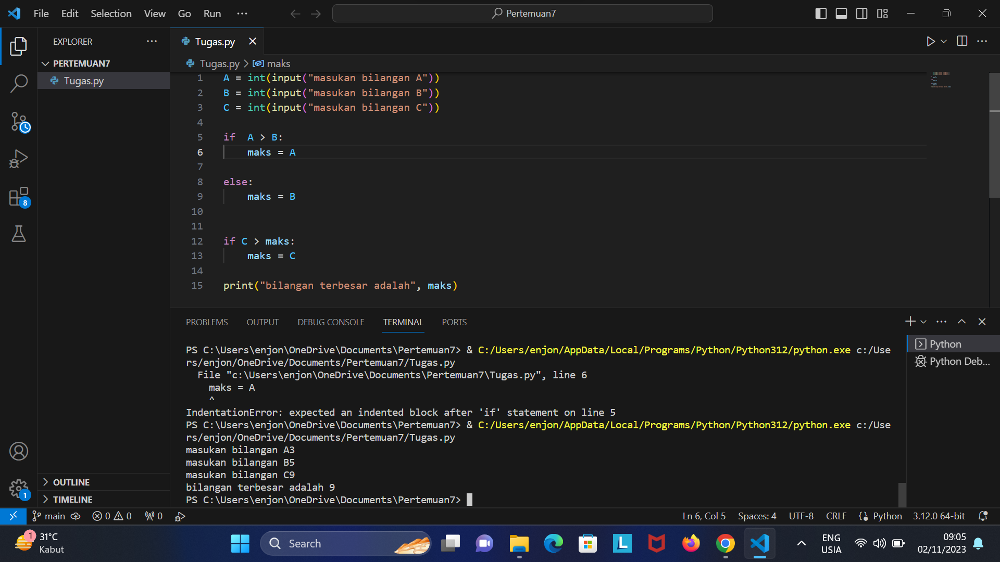
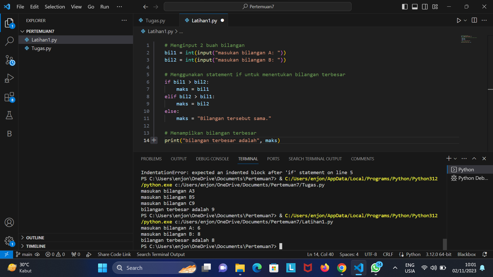
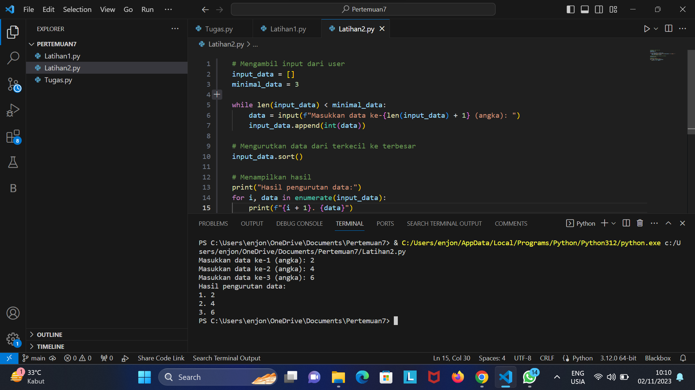

#PERTEMUAN 7

##PROFIL
| Variable | Isi |
| -------- | --- |
| *Nama* | HABIB SUPRAYOGA |
| *NIM* |  312310608 |
| *Kelas* | TI.23.A.6 |
| *Mata Kuliah* | Bahasa Pemrograman |


## Tugas modul praktikum 2 
### Latihan 

*Buat program sederhana dengan input tiga buah bilangan, dari ketiga bilangan
 tersebut tampilkan bilangan terbesarnya. Gunakan statement if.*

```Python
#Masukan inputan
A = int(input("masukan bilangan A"))
B = int(input("masukan bilangan B"))
C = int(input("masukan bilangan C"))

if  A > B:
    maks = A

else:
    maks = B


if C > maks:
    maks = C

print("bilangan terbesar adalah", maks)
```




## Tugas struktur kondisi 
### Latihan 1

*Buat program sederhada dengan input 2 buah bilangan, kemudian
 tentukan bilangan terbesar dari kedua bilangan tersebut
 menggunakan statement if.*

 ```Python
#Masukan inputan

# Menginput 2 buah bilangan
bil1 = int(input("masukan bilangan A: "))
bil2 = int(input("masukan bilangan B: "))

# Menggunakan statement if untuk menentukan bilangan terbesar
if bil1 > bil2:
    maks = bil1
elif bil2 > bil1:
    maks = bil2
else:
    maks = "Bilangan tersebut sama."

# Menampilkan bilangan terbesar
print("bilangan terbesar adalah", maks)
```



### Latihan 2

*Buat program untuk mengurutkan data berdasarkan input sejumlah
 data (minimal 3 variable input atau lebih), kemudian tampilkan
 hasilnya secara berurutan mulai dari data terkecil.*

 ```Python
#masukan inputan
# Mengambil input dari user
input_data = []
minimal_data = 3

while len(input_data) < minimal_data:
    data = input(f"Masukkan data ke-{len(input_data) + 1} (angka): ")
    input_data.append(int(data))

# Mengurutkan data dari terkecil ke terbesar
input_data.sort()

# Menampilkan hasil
print("Hasil pengurutan data:")
for i, data in enumerate(input_data):
    print(f"{i + 1}. {data}")
```

